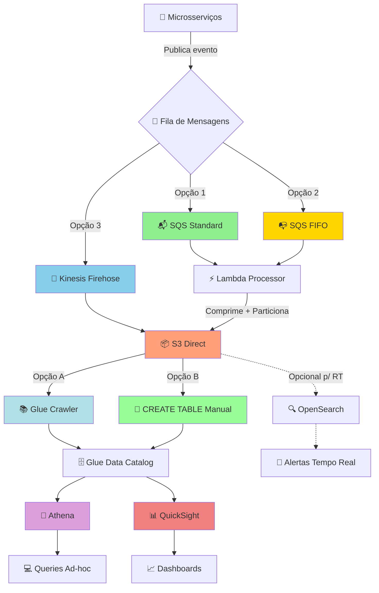
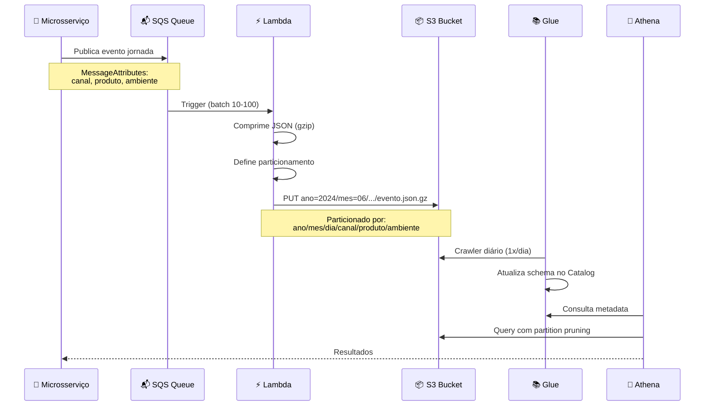
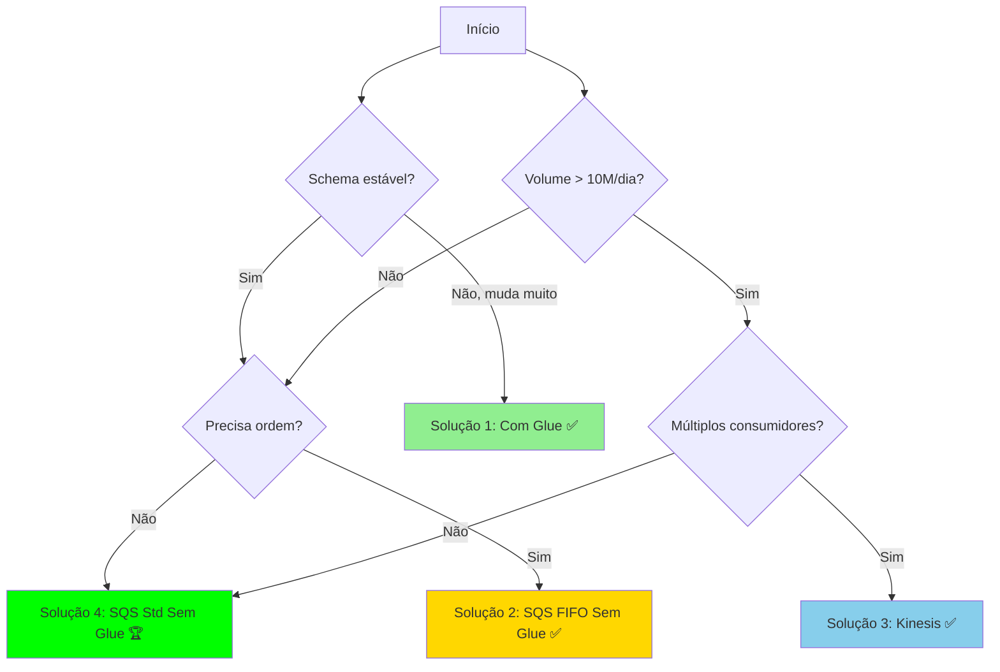

# 📊 LogViz - Visualização e Análise de Logs de Jornadas

## 🎯 Problema

Plataformas de backend com arquitetura de microsserviços geram **milhões de eventos de jornadas** (requisições/respostas) diariamente. O desafio é:

- 🔍 **Armazenar** grandes volumes de logs de forma econômica
- ⚡ **Consultar** rapidamente para troubleshooting e análise
- 📈 **Visualizar** métricas e KPIs em dashboards
- 💰 **Otimizar custos** de storage e query
- 🔧 **Facilitar debugging** em incidentes de produção

### Exemplo de Evento de Jornada

```json
{
  "idJornada": "J12345",
  "meta": {
    "canal": "Web",
    "produto": "ProdutoX",
    "ambiente": "Prod",
    "resumo_ia": "Renegociação com 4 etapas..."
  },
  "etapas": [
    {
      "nome": "Oferta",
      "servicos": [{
        "nome": "Serviço de Oferta",
        "url": "https://api.exemplo.com/soa",
        "method": "POST",
        "statusCode": 200,
        "integracoes": [...]
      }]
    }
  ]
}
```

## 🏗️ Arquiteturas Propostas

### 📐 Fluxo de Dados - Arquitetura Geral



### 🔄 Fluxo Detalhado com SQS (Recomendado)



## 🚀 Soluções Detalhadas

### Solução 1️⃣: SQS Standard + Lambda + S3 (💚 Recomendado)

#### Características

- ✅ **Simplicidade**: Configuração mínima
- ✅ **Custo-benefício**: ~$70-100/mês para 1M eventos
- ✅ **Escalabilidade**: Auto-scaling do Lambda
- ✅ **Confiabilidade**: DLQ para retry automático
- ⚠️ **Limitação**: Sem garantia de ordem

#### Implementação

**Particionamento S3:**

```
s3://bucket-logs/eventos/
  └── ano=2024/
      └── mes=06/
          └── dia=15/
              └── canal=web/
                  └── produto=produtoX/
                      └── ambiente=prod/
                          └── evento-J12345-20240615T080000.json.gz
```

**Lambda Function (Python):**

```python
import boto3
import json
import gzip
from datetime import datetime

s3 = boto3.client('s3')

def lambda_handler(event, context):
    for record in event['Records']:
        evento = json.loads(record['body'])
        dt = datetime.fromisoformat(evento['data'])
        
        # Particionamento
        s3_key = (
            f"eventos/"
            f"ano={dt.year}/"
            f"mes={dt.month:02d}/"
            f"dia={dt.day:02d}/"
            f"canal={evento['meta']['canal'].lower()}/"
            f"produto={evento['meta']['produto'].lower()}/"
            f"ambiente={evento['meta']['ambiente'].lower()}/"
            f"evento-{evento['idJornada']}-{dt.isoformat()}.json.gz"
        )
        
        # Compressão
        compressed = gzip.compress(json.dumps(evento).encode('utf-8'))
        
        # Upload
        s3.put_object(
            Bucket='bucket-logs',
            Key=s3_key,
            Body=compressed,
            ContentType='application/json',
            ContentEncoding='gzip'
        )
```

---

### Solução 2️⃣: SQS FIFO + Lambda + S3

#### Características

- ✅ **Ordem garantida**: Por MessageGroupId (idJornada)
- ✅ **Deduplicação**: Evita eventos duplicados
- ⚠️ **Throughput limitado**: 300 msgs/segundo por grupo
- ⚠️ **Custo maior**: +25% vs SQS Standard

---

### Solução 3️⃣: Kinesis Firehose + S3

#### Características

- ✅ **Streaming direto**: Sem Lambda intermediário
- ✅ **Transformação nativa**: Conversão para Parquet
- ✅ **Múltiplos consumidores**: Leitura simultânea
- ⚠️ **Custo**: ~10x mais caro que SQS
- ⚠️ **Complexidade**: Gerenciamento de shards

---

### Solução 4️⃣: SQS + Lambda + S3 + Athena (Sem Glue) 🎯

#### Características

- ✅ **Máxima simplicidade**: Zero serviços adicionais
- ✅ **Custo mínimo**: Sem Glue Crawler ($0.44/mês economizado)
- ✅ **Controle total**: Schema definido manualmente
- ⚠️ **Manutenção manual**: Alterar schema requer DDL
- ⚠️ **Sem auto-discovery**: Schema precisa ser conhecido

#### Implementação

**Criar Tabela Manualmente no Athena:**

```sql
-- Criar database
CREATE DATABASE IF NOT EXISTS eventos_db;

-- Criar tabela externa particionada
CREATE EXTERNAL TABLE IF NOT EXISTS eventos_db.eventos (
    idJornada string,
    data string,
    meta struct<
        dataHoraInicio: string,
        dataHoraFim: string,
        version: string,
        idEvento: string,
        canal: string,
        produto: string,
        ambiente: string,
        resumo_ia: string
    >,
    etapas array<struct<
        idEtapa: string,
        nome: string,
        dataHoraInicio: string,
        dataHoraFim: string,
        servicos: array<struct<
            nome: string,
            sigla: string,
            siglaApp: string,
            versaoApp: string,
            url: string,
            method: string,
            statusCode: int,
            header: map<string, string>,
            httpRequest: struct<body: map<string, string>, query: map<string, string>>,
            httpResponse: struct<body: map<string, string>>,
            integracoes: array<struct<
                nome: string,
                url: string,
                method: string,
                statusCode: int,
                header: map<string, string>,
                request: struct<body: map<string, string>, query: map<string, string>>,
                response: struct<body: map<string, string>>
            >>
        >>
    >>
)
PARTITIONED BY (
    ano int,
    mes int,
    dia int,
    canal string,
    produto string,
    ambiente string
)
ROW FORMAT SERDE 'org.openx.data.jsonserde.JsonSerDe'
LOCATION 's3://bucket-logs/eventos/'
TBLPROPERTIES (
    'projection.enabled' = 'true',
    'projection.ano.type' = 'integer',
    'projection.ano.range' = '2024,2030',
    'projection.mes.type' = 'integer',
    'projection.mes.range' = '1,12',
    'projection.mes.digits' = '2',
    'projection.dia.type' = 'integer',
    'projection.dia.range' = '1,31',
    'projection.dia.digits' = '2',
    'projection.canal.type' = 'enum',
    'projection.canal.values' = 'web,app,api',
    'projection.produto.type' = 'enum',
    'projection.produto.values' = 'produtox,produtoy,produtoz',
    'projection.ambiente.type' = 'enum',
    'projection.ambiente.values' = 'prod,staging,dev',
    'storage.location.template' = 's3://bucket-logs/eventos/ano=${ano}/mes=${mes}/dia=${dia}/canal=${canal}/produto=${produto}/ambiente=${ambiente}'
);
```

**🎯 Partition Projection (Auto-discovery de Partições)**

Com `projection.enabled=true`, o Athena automaticamente descobre novas partições sem precisar executar `MSCK REPAIR TABLE` ou `ALTER TABLE ADD PARTITION`. Isso elimina a necessidade do Glue Crawler!

**Validar Tabela:**

```sql
-- Verificar schema
DESCRIBE eventos_db.eventos;

-- Testar query
SELECT * FROM eventos_db.eventos 
WHERE ano=2024 AND mes=6 AND dia=15
LIMIT 10;
```

**Vantagens desta Abordagem:**

- 🚀 **Setup mais rápido**: Uma query DDL e pronto
- 💰 **Custo zero de catalogação**: Sem Glue Crawler
- 🎯 **Partition Projection**: Auto-discovery de partições
- 🔒 **Schema controlado**: Versionamento via Git
- ⚡ **Performance**: Mesma do Glue Catalog

---

## � Formato dos Arquivos: NDJSON (obrigatório para o Athena)

> [!IMPORTANT]
> Os arquivos `records.json` gravados no prefixo `meta/` **devem** estar no formato **NDJSON (Newline-Delimited JSON)** — um objeto JSON por linha, sem arrays e sem indentação. O Athena usa o `JsonSerDe` (`org.openx.data.jsonserde.JsonSerDe`), que lê **exatamente uma linha por registro**. Arquivos formatados como JSON arrays ou JSON multi-linha causam `HIVE_CURSOR_ERROR: Failed to read file`.

### ✅ Formato correto — NDJSON

Cada linha é um JSON completo e independente:

```ndjson
{"idJornada": "J12345", "canal": "Web", "produto": "ProdutoX", "total_erros_integracao": 0, "s3_detail_path": "s3://bucket-logs-eventos/jornadas/detail/ano=2024/mes=06/dia=15/J12345.json"}
{"idJornada": "J12346", "canal": "Mobile", "produto": "ProdutoY", "total_erros_integracao": 1, "s3_detail_path": "s3://bucket-logs-eventos/jornadas/detail/ano=2024/mes=06/dia=15/J12346.json"}
```

### ❌ Formato incorreto — JSON array

```json
[
  {"idJornada": "J12345", "canal": "Web"},
  {"idJornada": "J12346", "canal": "Mobile"}
]
```

### ❌ Formato incorreto — JSON multi-linha (pretty-printed)

```json
{
  "idJornada": "J12345",
  "canal": "Web"
}
{
  "idJornada": "J12346",
  "canal": "Mobile"
}
```

### 🔧 Conversão para NDJSON (Python)

```python
import json

decoder = json.JSONDecoder()
path = "records.json"

with open(path, "r", encoding="utf-8") as f:
    text = f.read().strip()

records, idx = [], 0
while idx < len(text):
    chunk = text[idx:].lstrip()
    if not chunk:
        break
    obj, end = decoder.raw_decode(chunk)
    records.append(obj)
    idx += len(text[idx:]) - len(chunk) + end

with open(path, "w", encoding="utf-8", newline="\n") as f:
    f.write("\n".join(json.dumps(r, ensure_ascii=False) for r in records) + "\n")
```

### 🛠️ Após corrigir os arquivos no S3

```sql
-- Forçar re-descoberta das partições
MSCK REPAIR TABLE "lab-logviz-database"."meta";

-- Ou, com Partition Projection habilitado, basta reexecutar a query
SELECT * FROM "lab-logviz-database"."meta" WHERE ano='2024' LIMIT 10;
```

---

## �📊 Exemplos de Queries (Athena SQL)

### 1. 🔴 Buscar Jornadas com Erro

```sql
SELECT 
    idJornada,
    meta.canal,
    meta.produto,
    meta.ambiente,
    etapa.nome AS etapa_nome,
    servico.nome AS servico_nome,
    servico.statusCode,
    servico.url,
    meta.dataHoraInicio
FROM eventos
CROSS JOIN UNNEST(etapas) AS t(etapa)
CROSS JOIN UNNEST(etapa.servicos) AS s(servico)
WHERE 
    ano = 2024 
    AND mes = 6 
    AND dia = 15
    AND servico.statusCode >= 400
    AND meta.ambiente = 'Prod'
ORDER BY meta.dataHoraInicio DESC
LIMIT 100;
```

### 2. ⏱️ Latência Média por Serviço

```sql
SELECT 
    servico.siglaApp,
    servico.nome,
    COUNT(*) AS total_requisicoes,
    AVG(CAST(date_diff('second', 
        CAST(etapa.dataHoraInicio AS timestamp),
        CAST(etapa.dataHoraFim AS timestamp)) AS DOUBLE)) AS latencia_media_seg,
    PERCENTILE(CAST(date_diff('second', 
        CAST(etapa.dataHoraInicio AS timestamp),
        CAST(etapa.dataHoraFim AS timestamp)) AS DOUBLE), 0.95) AS p95_latencia
FROM eventos
CROSS JOIN UNNEST(etapas) AS t(etapa)
CROSS JOIN UNNEST(etapa.servicos) AS s(servico)
WHERE 
    ano = 2024 
    AND mes = 6
    AND meta.ambiente = 'Prod'
GROUP BY servico.siglaApp, servico.nome
ORDER BY total_requisicoes DESC;
```

### 3. 🎯 Taxa de Sucesso por Produto e Canal

```sql
SELECT 
    meta.canal,
    meta.produto,
    DATE(CAST(meta.dataHoraInicio AS timestamp)) AS data,
    COUNT(*) AS total_jornadas,
    SUM(CASE 
        WHEN servico.statusCode >= 200 AND servico.statusCode < 300 
        THEN 1 ELSE 0 
    END) AS sucesso,
    ROUND(100.0 * SUM(CASE 
        WHEN servico.statusCode >= 200 AND servico.statusCode < 300 
        THEN 1 ELSE 0 
    END) / COUNT(*), 2) AS taxa_sucesso_pct
FROM eventos
CROSS JOIN UNNEST(etapas) AS t(etapa)
CROSS JOIN UNNEST(etapa.servicos) AS s(servico)
WHERE 
    ano = 2024 
    AND mes = 6
GROUP BY meta.canal, meta.produto, DATE(CAST(meta.dataHoraInicio AS timestamp))
ORDER BY data DESC, total_jornadas DESC;
```

### 4. 🔗 Análise de Integrações Mais Lentas

```sql
SELECT 
    integracao.nome,
    integracao.url,
    integracao.method,
    COUNT(*) AS total_chamadas,
    AVG(integracao.statusCode) AS avg_status,
    SUM(CASE WHEN integracao.statusCode >= 400 THEN 1 ELSE 0 END) AS erros,
    ROUND(100.0 * SUM(CASE WHEN integracao.statusCode >= 400 THEN 1 ELSE 0 END) / COUNT(*), 2) AS taxa_erro_pct
FROM eventos
CROSS JOIN UNNEST(etapas) AS t(etapa)
CROSS JOIN UNNEST(etapa.servicos) AS s(servico)
CROSS JOIN UNNEST(servico.integracoes) AS i(integracao)
WHERE 
    ano = 2024 
    AND mes = 6
    AND meta.ambiente = 'Prod'
GROUP BY integracao.nome, integracao.url, integracao.method
HAVING COUNT(*) > 100
ORDER BY taxa_erro_pct DESC, total_chamadas DESC;
```

### 5. 📈 Resumo Diário para Dashboard

```sql
CREATE TABLE eventos_resumo_diario AS
SELECT 
    DATE(CAST(meta.dataHoraInicio AS timestamp)) AS data,
    meta.canal,
    meta.produto,
    meta.ambiente,
    COUNT(DISTINCT idJornada) AS total_jornadas,
    COUNT(*) AS total_requisicoes,
    AVG(CAST(date_diff('minute', 
        CAST(meta.dataHoraInicio AS timestamp),
        CAST(meta.dataHoraFim AS timestamp)) AS DOUBLE)) AS duracao_media_min,
    SUM(CASE 
        WHEN servico.statusCode >= 500 THEN 1 ELSE 0 
    END) AS erros_servidor,
    SUM(CASE 
        WHEN servico.statusCode >= 400 AND servico.statusCode < 500 
        THEN 1 ELSE 0 
    END) AS erros_cliente
FROM eventos
CROSS JOIN UNNEST(etapas) AS t(etapa)
CROSS JOIN UNNEST(etapa.servicos) AS s(servico)
WHERE ano = 2024 AND mes = 6
GROUP BY 1, 2, 3, 4;
```

---

## 📈 Informações para Dashboard (QuickSight)

### KPIs Principais

#### 1️⃣ **Visão Executiva**

- 📊 Total de Jornadas (dia/semana/mês)
- ✅ Taxa de Sucesso Global (%)
- ⏱️ Tempo Médio de Jornada
- 🔴 Top 5 Erros Mais Frequentes
- 📉 Tendência de Performance (últimos 30 dias)

#### 2️⃣ **Análise por Produto/Canal**

- 🎯 Distribuição de Volume por Canal (Pie Chart)
- 📊 Jornadas por Produto (Bar Chart)
- 🌊 Heatmap de Horários de Pico
- 📈 Tendência de Crescimento por Produto

#### 3️⃣ **Performance de Serviços**

- ⚡ Top 10 Serviços Mais Lentos (Latência P95)
- 🔗 Mapa de Dependências (Integrações mais chamadas)
- 📊 Taxa de Erro por Serviço (últimas 24h)
- 🎨 Status Code Distribution

#### 4️⃣ **Troubleshooting**

- 🔍 Timeline de Eventos com Erro
- 📋 Log de Jornadas Incompletas
- ⚠️ Alertas de SLA Violado
- 🔗 Correlation ID Tracker

### Exemplo de Visualização

```
┌─────────────────────────────────────────────────────────┐
│  📊 Dashboard - Visão Geral de Jornadas                 │
├─────────────────────────────────────────────────────────┤
│                                                          │
│  📈 Total: 1.2M      ✅ Sucesso: 98.5%    ⏱️ Avg: 2.3min │
│                                                          │
│  ┌──────────────────┐  ┌──────────────────────────┐    │
│  │ Taxa de Sucesso  │  │  Volume por Canal        │    │
│  │                  │  │  ┌────┐                  │    │
│  │      98.5%       │  │  │Web │ 65%              │    │
│  │   ↑ +0.3%       │  │  │App │ 25%              │    │
│  │   vs ontem       │  │  │API │ 10%              │    │
│  └──────────────────┘  └──────────────────────────┘    │
│                                                          │
│  ┌────────────────────────────────────────────────┐    │
│  │ Top 5 Erros (últimas 24h)                      │    │
│  ├────────────────────────────────────────────────┤    │
│  │ 1. Timeout Validação CPF         125 ocorr.   │    │
│  │ 2. 502 Serviço Financiamento      89 ocorr.   │    │
│  │ 3. 404 Endpoint Pagamento         67 ocorr.   │    │
│  │ 4. 500 Sincronização Estoque      45 ocorr.   │    │
│  │ 5. 429 Rate Limit API Externa     32 ocorr.   │    │
│  └────────────────────────────────────────────────┘    │
└─────────────────────────────────────────────────────────┘
```

---

## 💰 Comparação de Custos

### Estimativa para **1 milhão de eventos/mês** (~33k eventos/dia)

| Componente                    | Solução 1 (SQS Std) | Solução 2 (SQS FIFO) | Solução 3 (Kinesis) | Solução 4 (Sem Glue) |
| ----------------------------- | ------------------- | -------------------- | ------------------- | -------------------- |
| **Fila de Mensagens**         | $0.40               | $0.50                | $25.00 (1 shard)    | $0.40                |
| **Lambda**                    | $5.00               | $5.00                | -                   | $5.00                |
| **S3 Storage (1TB)**          | $23.00              | $23.00               | $23.00              | $23.00               |
| **Glue Crawler**              | $0.44               | $0.44                | $0.44               | **$0.00** 🎯          |
| **Athena Queries (5TB scan)** | $25.00              | $25.00               | $25.00              | $25.00               |
| **QuickSight**                | $24.00              | $24.00               | $24.00              | $24.00               |
| **Data Transfer**             | $2.00               | $2.00                | $5.00               | $2.00                |
| **TOTAL/MÊS**                 | **~$79.84** 💚       | **~$79.94**          | **~$102.44**        | **~$79.40** 🏆        |

### Estimativa para **10 milhões de eventos/mês** (~333k eventos/dia)

| Componente                     | Solução 1 (SQS Std) | Solução 2 (SQS FIFO) | Solução 3 (Kinesis) | Solução 4 (Sem Glue) |
| ------------------------------ | ------------------- | -------------------- | ------------------- | -------------------- |
| **Fila de Mensagens**          | $4.00               | $5.00                | $100.00 (4 shards)  | $4.00                |
| **Lambda**                     | $50.00              | $50.00               | -                   | $50.00               |
| **S3 Storage (10TB)**          | $230.00             | $230.00              | $230.00             | $230.00              |
| **Glue Crawler**               | $4.40               | $4.40                | $4.40               | **$0.00** 🎯          |
| **Athena Queries (50TB scan)** | $250.00             | $250.00              | $250.00             | $250.00              |
| **QuickSight**                 | $24.00              | $24.00               | $24.00              | $24.00               |
| **Data Transfer**              | $20.00              | $20.00               | $50.00              | $20.00               |
| **TOTAL/MÊS**                  | **~$582.40** 💚      | **~$583.40**         | **~$658.40**        | **~$578.00** 🏆       |

### 💡 Otimizações de Custo

| **Fila de Mensagens** | $4.00 | $5.00 | $100.00 (4 shards) |
| **Lambda** | $50.00 | $50.00 | - |
| **S3 Storage (10TB)** | $230.00 | $230.00 | $230.00 |
| **Glue Crawler** | $4.40 | $4.40 | $4.40 |
| **Athena Queries (50TB scan)** | $250.00 | $250.00 | $250.00 |
| **QuickSight** | $24.00 | $24.00 | $24.00 |
| **Data Transfer** | $20.00 | $20.00 | $50.00 |
| **TOTAL/MÊS** | **~$582.40** 💚 | **~$583.40** | **~$658.40** |

### 💡 Otimizações de Custo

#### 1. **S3 Lifecycle Policies**

```
Dias 0-30:    S3 Standard         ($23/TB)
Dias 31-90:   S3 IA               ($12.50/TB) → -46% custo
Dias 91-365:  Glacier             ($4/TB)     → -83% custo
Dias 365+:    Deep Archive        ($1/TB)     → -96% custo
```

**Economia estimada: ~$15-20/mês** para 1M eventos

#### 2. **Conversão para Parquet**

- Redução de 60-80% no tamanho dos arquivos
- Queries 10x mais rápidas
- **Economia Athena: ~$15-20/mês**

#### 3. **Tabelas Agregadas**

- Pré-computar métricas diárias/horárias
- Reduzir scan de 50TB → 500GB
- **Economia Athena: ~$200/mês** em altos volumes

---

## ⚖️ Trade-offs das Soluções

### 🟢 Solução 1: SQS Standard + Lambda + S3

| Prós ✅                     | Contras ❌                    |
| -------------------------- | ---------------------------- |
| Custo mais baixo           | Sem garantia de ordem        |
| Configuração simples       | Possibilidade de duplicação  |
| Auto-scaling nativo        | Latência variável (1-5 seg)  |
| DLQ para retry             | Limite de 256KB por mensagem |
| Sem gerenciamento de infra | -                            |

**💡 Use quando:**

- Eventos independentes sem necessidade de ordem
- Prioridade é custo e simplicidade
- Volume < 1M msgs/dia

---

### 🟡 Solução 2: SQS FIFO + Lambda + S3

| Prós ✅                        | Contras ❌                      |
| ----------------------------- | ------------------------------ |
| Ordem garantida por grupo     | Throughput limitado (300/seg)  |
| Deduplicação automática       | Custo 25% maior                |
| Todas as vantagens do SQS Std | Complexidade do MessageGroupId |
| -                             | Latência ligeiramente maior    |

**💡 Use quando:**

- Precisa ordem garantida por jornada
- Volume moderado (< 25M msgs/dia)
- Não pode ter eventos duplicados

---

### 🔵 Solução 3: Kinesis Firehose + S3

| Prós ✅                         | Contras ❌                      |
| ------------------------------ | ------------------------------ |
| Streaming direto (sem Lambda)  | Custo 10x maior que SQS        |
| Transformação nativa (Parquet) | Gerenciamento de shards        |
| Múltiplos consumidores         | Over-engineering para logs     |
| Replay de eventos (até 365d)   | Precisa dimensionar capacidade |
| Baixa latência (< 1 seg)       | -                              |

**💡 Use quando:**

- Precisa de múltiplos consumidores simultâneos
- Requisito de streaming analytics em tempo real
- Já usa Kinesis em outros sistemas
- Orçamento disponível para maior custo

---

### 🟢 Solução 4: SQS Standard + Lambda + S3 (Sem Glue)

| Prós ✅                          | Contras ❌                   |
| ------------------------------- | --------------------------- |
| **Custo mais baixo de todas**   | Schema manual (DDL)         |
| Todas as vantagens do SQS Std   | Mudanças de schema = código |
| Partition Projection automático | Sem UI visual do schema     |
| Setup instantâneo (1 query)     | Precisa conhecer SQL DDL    |
| Schema versionado no Git        | -                           |
| Zero dependências extras        | -                           |

**💡 Use quando:**

- Prioridade máxima em custo e simplicidade
- Schema estável e bem definido
- Time confortável com SQL DDL
- Quer controle total do schema
- Não precisa de auto-discovery de campos

---

## 🎯 Recomendação Final

### Para a maioria dos casos: **Solução 4 (SQS + S3 Sem Glue) 🏆**



    style C fill:#90EE90
    style F fill:#FFD700
    style G fill:#87CEEB

```

### Roadmap de Evolução

#### 🚀 Abordagem Simplificada (Recomendada)

```

Fase 1 (MVP - Dia 1):
├── SQS Standard + Lambda + S3 (JSON.gz)
├── CREATE TABLE manual com Partition Projection
└── Athena queries básicas
💰 Custo: ~$79/mês | ⏱️ Setup: 2-4 horas

Fase 2 (Otimização - Semana 2-4):
├── Conversão para Parquet
├── Tabelas agregadas
├── QuickSight dashboards
└── S3 Lifecycle policies
💰 Custo: ~$60/mês | 📈 Performance: +10x

Fase 3 (Escala - Mês 2-3):
├── OpenSearch para queries RT (opcional)
├── Alertas automáticos
├── ML para detecção de anomalias
└── Data retention policies
💰 Custo: ~$150-200/mês (com OpenSearch)

```

#### 🔧 Abordagem com Auto-Discovery

```

Fase 1 (MVP):
├── SQS Standard + Lambda + S3 (JSON.gz)
├── Glue Crawler (agendado diariamente)
└── Athena queries básicas
💰 Custo: ~$80/mês | ⏱️ Setup: 3-5 horas

Fase 2-3: Mesmas otimizações acima

```

---

## 🚀 Getting Started

### 1. Criar Infraestrutura (Terraform/CloudFormation)

```bash
# Criar SQS Queue
aws sqs create-queue \
  --queue-name eventos-jornada \
  --attributes DelaySeconds=0,MaximumMessageSize=262144

# Criar S3 Bucket
aws s3 mb s3://bucket-logs-eventos --region us-east-1

# Criar Lambda Function
aws lambda create-function \
  --function-name processar-eventos \
  --runtime python3.11 \
  --role arn:aws:iam::123456:role/lambda-s3-role \
  --handler lambda_function.lambda_handler \
  --zip-file fileb://function.zip
```

### 2. Configurar Glue Crawler

```bash
aws glue create-crawler \
  --name eventos-crawler \
  --role AWSGlueServiceRole \
  --database-name eventos_db \
  --targets '{"S3Targets":[{"Path":"s3://bucket-logs/eventos/"}]}'
```

### 3. Primeira Query no Athena

```sql
SELECT * FROM eventos 
WHERE ano=2024 AND mes=6 AND dia=15 
LIMIT 10;
```

---

## 📚 Referências

- [AWS SQS Best Practices](https://docs.aws.amazon.com/AWSSimpleQueueService/latest/SQSDeveloperGuide/sqs-best-practices.html)
- [Athena Performance Tuning](https://docs.aws.amazon.com/athena/latest/ug/performance-tuning.html)
- [S3 Lifecycle Configuration](https://docs.aws.amazon.com/AmazonS3/latest/userguide/object-lifecycle-mgmt.html)
- [Parquet vs JSON Performance](https://aws.amazon.com/blogs/big-data/top-10-performance-tuning-tips-for-amazon-athena/)

---

## 📝 License

MIT License - Sinta-se livre para usar e modificar

---

**Criado por:** LogViz Team  
**Última atualização:** Janeiro 2026  
**Versão:** 1.0.0
